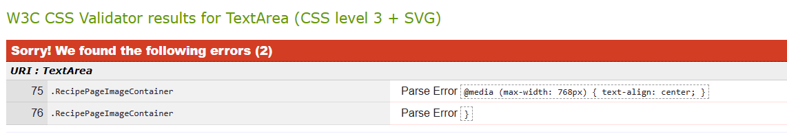

# Frontend Testing

***Links to other readme and testing files.***
[Frontend README.md](https://github.com/redifo/recipe-drf-api/blob/main/README.md).

[Backend README.md](https://github.com/redifo/recipe-drf-api/blob/main/README-BACKEND.md).

[BACKEND-TESTING](https://github.com/redifo/recipe-drf-api/blob/main/BACKEND-TESTING.md).

## Table of Contents

- [Frontend Testing](#frontend-testing)
  * [Table of Contents](#table-of-contents)
  * [Manual testing](#manual-testing)
  * [Automated tests](#automated-tests)
  * [Validator testing](#validator-testing)
    + [W3C CSS validator](#w3c-css-validator)
    + [ESLint JavaScript validator](#eslint-javascript-validator)
  * [Web Accessability Testing](#web-accessability-testing)
    + [WAVE web accessability testing](#wave-web-accessability-testing)
    + [Lighthouse testing](#lighthouse-testing)
  * [Resolved bugs](#resolved-bugs)
  * [Unresolved bugs](#unresolved-bugs)

<small><i><a href='http://ecotrust-canada.github.io/markdown-toc/'>Table of contents generated with markdown-toc</a></i></small>

## Manual testing

Tests were created manually for each user story planned for the project. These tests were executed on the final version of the deployed website and are detailed below.

| **User Story** | **Action** | **Expected Result** | **Result** |
| --- | --- | --- | :---: |
| As a user, I can create a new account | Complete and submit the registration form | User is successfully registered and can access their account | pass |
| As a user, I can sign in to the app | Enter login credentials and submit | Access to personalized content like recipe collection and followed chefs | pass |
| As a user, I can easily tell if I am logged in or not | Observe the app's interface | Clear indication of login status shown on the interface | pass |
| As a logged-out user, I can see sign in and sign up options | Visit the app while logged out | Sign in and sign up options are visible and accessible | pass |
| As a user, I want my session to stay active as long as I'm using the site | Interact with the site over time without logging out | Session remains active without needing to log in again | pass |
| As a user, I can view my own and other users' avatars | Browse the app's user profiles or comments | Avatars are visible next to user-related content | pass |
| As a logged-in user, I can post new recipes | Navigate to the recipe creation page and submit a new recipe | New recipe is posted and visible on the platform | pass |
| As a user, I can view the details of a recipe | Click on a recipe to view its full details | Detailed view of the recipe including ingredients and instructions | pass |
| As a logged-in user, I can rate a recipe | Choose a rating and submit it on a recipe's page | Rating is recorded and affects the recipe's overall score | pass |
| As the creator of a recipe, I can edit it | Click the edit button on their recipe and submit changes | Changes are saved and the updated recipe is displayed | pass |
| As the creator of a recipe, I can remove it from the website | Click the delete button on their recipe | Recipe is deleted and no longer available on the platform | pass |
| As a user, I can view all the most recent recipes, ordered by most recently created first | Access the homepage or a specific section for new recipes | Recent recipes are displayed in the correct order | pass |
| As a user, I can search for recipes with keywords | Enter keywords in the search bar and submit | Display of recipes that match the search criteria | pass |
| As a logged-in user, I can view the recipes I have rated highly | Navigate to a section for highly-rated recipes | Display of recipes the user has rated highly | pass |
| As a logged-in user, I can review on a recipe | Submit a review on a recipe's page | Review is posted and visible to other users | pass |
| As a user, I can see when a review was made | View the details of a review | Timestamp or date is displayed next to the review | pass |
| As a user, I can read reviews on a recipe | Access a recipe's page | Reviews from other users are visible and readable | pass |
| As the owner of a review, I can delete it | Click the delete option on their review | Review is removed from the platform | pass |
| As the owner of a review, I can edit it | Click the edit option on their review and submit changes | Updated review is displayed with the changes | pass |
| As a user, I can view my own and other users' profiles | Visit a user's profile page | Profile details including posted recipes and liked dishes are displayed | pass |
| As a user, I can see a list of the most followed chefs | Navigate to the section displaying popular chefs | List of chefs with the highest number of followers is shown | pass |
| As a user, I can view statistics about a chef | Visit a chef's profile | Statistics including bio, number of recipes, and followers are displayed | pass |
| As a logged-in user, I can follow and unfollow chefs | Click follow/unfollow on a chef's profile | Changes in followed chefs are reflected in the user's feed | pass |
| As a user, I can see all recipes posted by a specific chef | Visit a chef's profile | All recipes by the chef are displayed | pass |
| As a logged-in user, I can update my profile with a new avatar and bio | Edit profile settings and submit changes | Profile is updated with the new avatar and bio | pass |
| As a recipe owner, I want to receive notifications when other users review my recipes | Review is posted on a recipe they own | Notifications are sent to the recipe owner about the new review | pass |

Due to the limited time constraint for this project the user stories listed in the table below were not implemented and have no results section. These features will be implemented later and will be tested according to their expected outcomes. 

| **User Story** | **Action** | **Expected Result** | **Result** |
| --- | --- | --- | :---: |
| As a user, I want to get notified when other users like my comments | Engage in the community by commenting and observe notifications | Receive notifications indicating which comments are liked by others |  |
| As a user who follows other chefs, I want to receive notifications when these chefs post new recipes | Follow chefs and check notifications | Notifications are received when followed chefs post new recipes |  |
| As a user, I want to have the option to choose whether or not I receive notifications about new posts or likes from people I follow | Access notification settings and adjust preferences | User can control the frequency and type of notifications received |  |
| As a user, I want to be able to mark notifications as read | Interact with the notification list and mark items as read | Notifications are marked as read and the list is updated accordingly |  |
| As a user, I want to set preferences for different types of notifications | Navigate to settings and customize notification preferences | User receives notifications only for the selected activities of interest |  |

## Automated tests

## Validator testing
### W3C HTML Validation
[W3C Markup Validation](https://validator.w3.org/) is a service provided by the W3C that validates HTML code against official specifications, ensuring syntax correctness and adherence to web standards.

| **Tested** | **Result** | **View Result** | **Pass** |
--- | --- | --- | :---:
|All website pages| No errors | 

Screenshot of result

| :check_mark:

### W3C CSS validator

[W3C Jigsaw](https://jigsaw.w3.org/css-validator/) is a tool by the W3C for validating CSS code, ensuring compliance with web standards and promoting interoperability and accessibility.

The validator have shown that there were some issues in some of the css files (only 3 files and all the errors were due to the way i have used @media) and all errors have been fixed in the end. An example of the error can be seen below. 

    

| **Tested** | **Result** | **View Result** | **Pass** |
--- | --- | --- | :---:
| all style files | no errors | 

Screenshot of result

| :check_mark:

### ESLint JavaScript validator

All JavaScript files were validated using the ESLint JavaScript validator duting development and all warning and errors ahve been solved as sson as they appear or as soon as possoible. Identified issues were addressed accordingly.

## Web Accessability Testing
### WAVE web accessability testing
### Lighthouse testing

## Resolved bugs

## Unresolved bugs