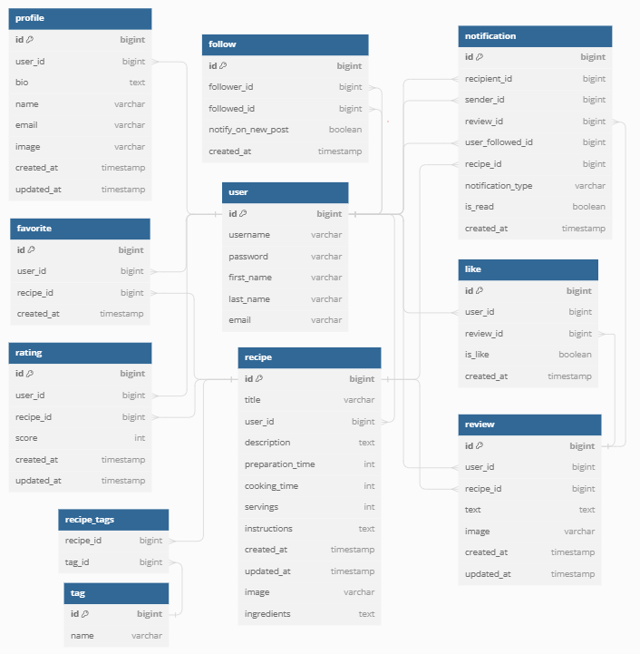

# Recipe Domain Backend 

## Project Goals
The primary objective of the backend for Recipe Domain is to support a dynamic and engaging platform for culinary enthusiasts. This involves:

1) Establishing a robust API that enables efficient searching, filtering, and retrieval of recipes based on diverse criteria such as ingredients, preparation time, and user preferences.
2) Facilitating user interactions, including the ability to save, organize, and manage favorite recipes, enhancing the personalization of the culinary experience.
3) Supporting a community-oriented environment where users can share their culinary creations, post reviews, and engage with other food lovers, fostering a vibrant network of recipe exchange and feedback.
4) Ensuring a seamless and secure user experience with reliable authentication, notification systems, and user profile management to maintain a high level of usability and accessibility for all users, regardless of their technical expertise.

## Table of contents
- [Recipe Domain Backend](#recipe-domain-backend)
  * [Project Goals](#project-goals)
  * [Table of contents](#table-of-contents)
  * [Planning](#planning)
    + [Data Models](#data-models)
      - [**User**](#--user--)
      - [**Profile**](#--profile--)
      - [**Recipe**](#--recipe--)
      - [**Tag**](#--tag--)
      - [**Review**](#--review--)
      - [**Rating**](#--rating--)
      - [**Notification**](#--notification--)
      - [**Like**](#--like--)
      - [**Follow**](#--follow--)
      - [**Favorite**](#--favorite--)
  * [API endpoints](#api-endpoints)
  * [Authentication Endpoints](#authentication-endpoints)
  * [Frameworks, Libraries, and Dependencies](#frameworks--libraries--and-dependencies)
    + [Database](#database)
    + [Key Settings and Configurations](#key-settings-and-configurations)
  * [Resolved bugs](#resolved-bugs)
  * [Unresolved bugs](#unresolved-bugs)
  * [Credits](#credits)

<small><i><a href='http://ecotrust-canada.github.io/markdown-toc/'>Table of contents generated with markdown-toc</a></i></small>

## Planning
The planning phase of the project began with defining epics and user stories to shape the frontend application based on project objectives. These user stories informed the creation of wireframes that outlined the intended functionality and user flow through the application. 

The initial project plan aimed to replicate the structure and functionality of the Moments walkthrough project provided by the Code Institute. However, after a preliminary meeting with my mentor, Jubril Akole, it became evident that adding a notifications table and an image field to reviews would significantly enrich the user experience. This enhancement was incorporated into the development phase, extending the app's capabilities beyond the original blueprint.

During the development process, it was recognized that using a text field for ingredients lacked the intuitiveness and flexibility users typically expect. A more sophisticated approach, allowing users to specify quantities for each ingredient, was considered to improve usability. This feature would enable users to filter recipes based on ingredients from a comprehensive list, offering a more tailored experience. However, due to the constrained timeline of the project, this enhancement was not implemented but is earmarked for future development.

Furthermore, the `email` and `name` fields in the profile table are currently not utilized in the frontend application. These fields were designed with future enhancements in mind, providing a foundation for extending the app's functionality. As the project evolves, these fields can be leveraged to introduce additional features, enhancing the overall user experience and interaction within the app.

### Data Models
Data models were developed in parallel with API endpoints, using an entity relationship diagram to ensure seamless integration and functionality. Here’s an overview of the custom models designed for this project:

#### **User**
- Represents the core user model for authentication and identification within the system.
- Fields: `id`, `username`, `password`, `first_name`, `last_name`, `email`.

#### **Profile**
- A one-to-one relationship with the User model, automatically created upon user registration.
- Stores additional user information such as bio, name, email, and profile image.
- The `image` field is constrained by size validators to ensure that uploads do not exceed 4MB, maintaining performance and storage efficiency.
- Fields: `id`, `user_id`, `bio`, `name`, `email`, `image`, `created_at`, `updated_at`.

#### **Recipe**
- Central to the application, holding detailed information about each recipe.
- Many-to-one relationship with User to track recipe ownership.
- Many-to-many relationship with Tag via `recipe_tags` for categorization.
- Validators ensure that `preparation_time` and `cooking_time` fall within a reasonable range (e.g., 1 to 999 minutes) to prevent unrealistic entries.
- The `image` field is constrained by size validators to ensure that uploads do not exceed 4MB, maintaining performance and storage efficiency.
- Fields: `id`, `title`, `user_id`, `description`, `preparation_time`, `cooking_time`, `servings`, `instructions`, `created_at`, `updated_at`, `image`, `ingredients`.

#### **Tag**
- Used for categorizing recipes for enhanced searchability and organization.
- Fields: `id`, `name`.

#### **Review**
- Allows users to provide feedback on recipes with textual content and optional images.
- Many-to-one relationship with User and Recipe.
- Validators on the `image` field restrict file size to a maximum of 4MB and enforce dimension constraints, ensuring both quality and efficiency of storage.
- Fields: `id`, `user_id`, `recipe_id`, `text`, `image`, `created_at`, `updated_at`.

#### **Rating**
- Facilitates scoring of recipes by users to reflect quality or preference.
- Many-to-one relationship with User and Recipe to ensure each rating is unique per user-recipe pair.
- Fields: `id`, `user_id`, `recipe_id`, `score`, `created_at`, `updated_at`.

#### **Notification**
- Manages alerts and updates for users regarding recipe reviews, follows, and likes.
- Fields: `id`, `recipient_id`, `sender_id`, `review_id`, `user_followed_id`, `recipe_id`, `notification_type`, `is_read`, `created_at`.

#### **Like**
- Represents user endorsements (likes) for reviews.
- Many-to-one relationship with User and Review.
- Fields: `id`, `user_id`, `review_id`, `is_like`, `created_at`.

#### **Follow**
- Captures the follow relationship between users.
- Fields: `id`, `follower_id`, `followed_id`, `notify_on_new_post`, `created_at`.

#### **Favorite**
- Allows users to mark recipes as favorites for easy access and reference.
- Many-to-one relationship with User and Recipe.
- Fields: `id`, `user_id`, `recipe_id`, `created_at`.

Each model is designed to support the core functionalities of the app, from user interactions with recipes to social features and notifications. This structured approach ensures a comprehensive and efficient user experience across the platform.

    

    For a detailed view of the database schema, visit:
    <a href="readme-documentation/db.png" target="_rel">Full-Size DB Schema</a>

## API endpoints

| Resources     | Methods | PROFILES (name, bio, avatar, etc.) | RECIPES (title, ingredients, instructions, etc.) | REVIEWS (text, images, likes) | RATINGS (score) | FOLLOWS (follower_id, followed_id) | FAVORITES (recipe_id) | LIKES (review_id, is_like) | NOTIFICATIONS (type, sender, recipient) |
|---------------|---------|------------------------------------|-------------------------------------------------|-------------------------------|-----------------|-----------------------------------|----------------------|--------------------------|----------------------------------------|
| create / POST | `POST`  | ✖                                 | ✔                                               | ✔                             | ✔               | ✔                                 | ✔                    | ✔                        | ✔                                      |
| retrieve / GET | `GET`  | ✔                                 | ✔                                               | ✔                             | ✔               | ✔                                 | ✔                    | ✔                        | ✔                                      |
| update / PUT  | `PUT`   | ✔                                 | ✔ (own recipes)                                 | ✔ (own reviews)               | ✔ (own ratings) | ✖                                 | ✖                    | ✔ (own likes)            | ✖                                      |
| destroy / DELETE | `DELETE` | ✖                             | ✔ (own recipes)                                 | ✔ (own reviews)               | ✔ (own ratings) | ✔ (own follows)                   | ✔ (own favorites)     | ✔ (own likes)            | ✔ (own notifications)                  |
| list / GET    | `GET`   | ✔                                 | ✔                                               | ✔                             | ✔               | ✔                                 | ✔                    | ✔                        | ✔                                      |
| search / GET  | `GET`   | ✖                                 | ✔                                               | ✖                             | ✖               | ✖                                 | ✖                    | ✖                        | ✖                                      |

## Authentication Endpoints

| Authentication | registration (POST) | login (POST) | logout (POST) | user (GET) | refresh token (POST) | change password (POST) |
|----------------|---------------------|--------------|---------------|------------|----------------------|-----------------------|
| endpoint       | `/api/auth/registration/` | `/api/auth/login/` | `/api/auth/logout/` | `/api/auth/user/` | `/api/auth/token/refresh/` | `/api/auth/password/change/` |
| expected value | username, email, password1, password2 | username, password | Token | Token | Refresh Token | Old Password, New Password1, New Password2 |

## Frameworks, Libraries, and Dependencies

- **Django Rest Framework (3.15.1)**: Serves as the foundation for creating RESTful APIs, handling client-server interactions efficiently. Utilized for all data management and CRUD operations within the app.
- **JWT Authentication**: Ensures secure and scalable user authentication using JSON Web Tokens, integrated through `dj_rest_auth (2.1.9)` and Django's authentication systems.
- **Cloudinary (1.39.1)**: Used for cloud-based image storage, simplifying the management of user-uploaded images like profile pictures and recipe photos. Configured through `dj3-cloudinary-storage (0.0.6)` to handle media files.
- **Django Filters (2.4.0)**: Implemented for advanced querying capabilities, allowing users to filter recipes and other content based on various criteria. Enabled in the app through `django_filters`.
- **WhiteNoise (6.4.0)**: Facilitates efficient static file serving in Django applications, especially when deployed. Integrated to manage static files seamlessly.
- **Django Rest Auth & Allauth (0.44.0)**: Provide comprehensive user authentication, including registration and login functionalities, connected with `dj_rest_auth` and `allauth`.
- **CORS Headers (django-cors-headers 4.3.1)**: Configured to allow resource sharing between the frontend and backend, supporting cross-origin requests. Essential for interactions between different domains during development and production.

### Database
- **Neon Database**: Utilized [Neon](https://neon.tech/) for the database to leverage its cloud-native PostgreSQL capabilities, ensuring scalable and efficient data management.
- **PostgreSQL**: Chosen for its robustness and scalability in storing and managing user and recipe data. 

### Key Settings and Configurations
- `SECRET_KEY`, `DEBUG`, and `ALLOWED_HOSTS` are standard Django settings adjusted for security and operational context.
- `REST_FRAMEWORK` configuration ensures JWT is used for authentication, with custom pagination and rendering settings.
- `CORS_ALLOWED_ORIGINS` and `CORS_ALLOW_CREDENTIALS` are set to ensure the frontend can interact with the API without CORS issues.
- `INSTALLED_APPS` includes several custom apps like `profiles`, `recipes`, `reviews`, `ratings`, `followers`, `likes`, `notifications`, and `favorites` which define the core functionality of the application.
- Static and media file handling are configured with Django's standard settings and `WhiteNoise` for production readiness.

## Resolved bugs

## Unresolved bugs

## Credits