# Recipe Domain

    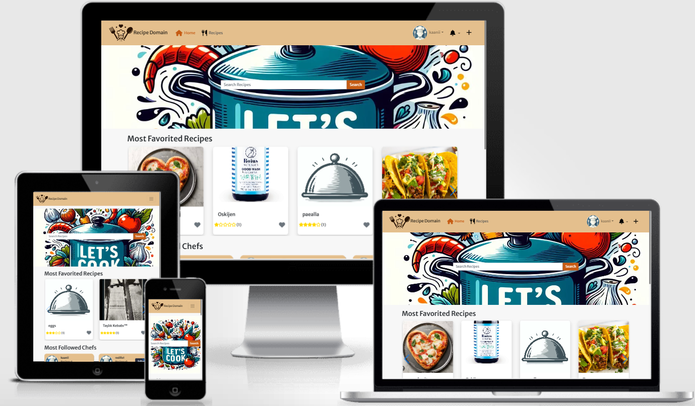

Recipe Domain is an interactive web application designed to simplify the process of finding, organizing, and sharing culinary recipes. It serves as a central hub for food enthusiasts to discover new recipes, manage their favorites, and share their culinary creations with others. The platform aims to provide a user-friendly environment where users can easily search, filter, and interact with a wide variety of recipes.

***Links to other readme and testing files.***
[Backend README.md](https://github.com/redifo/recipe-drf-api/blob/main/README-BACKEND.md).
[FRONTEND-TESTING](https://github.com/redifo/recipe-drf-api/blob/main/FRONTEND-TESTING.md).
[BACKEND-TESTING](https://github.com/redifo/recipe-drf-api/blob/main/BACKEND-TESTING.md).

## Project Goals
The main goals of Recipe Domain are:
1) Provide a platform for users to easily find recipes based on various criteria such as ingredients or cooking time.
2) Allow users to save and organize their favorite recipes in a personalized way.
3) Enable users to share recipes with others and participate in a community of food enthusiasts.
4) Offer a intuitive user interface that is accessible to users of all tech skill levels.

## Table of Contents
- [Recipe Domain](#recipe-domain)
  * [Project Goals](#project-goals)
  * [Table of Contents](#table-of-contents)
  * [User Stories and Agile Development Methodology](#user-stories-and-agile-development-methodology)
  * [Planning](#planning)
  * [Design](#design)
  * [Features](#features)
  * [Technologies Used](#technologies-used)
  * [Testing](#testing)
  * [Deployment](#deployment)
  * [Credits](#credits)

## User Stories and Agile Development Methodology

In this project, I used an agile development methodology to manage the development process efficiently. I document each feature and task as an issue within GitHub, utilizing the MoSCoW prioritization method. Labels such as 'Must Have', 'Should Have', 'Could Have', and 'Won't Have' help in determining the essential features necessary for a Minimum Viable Product (MVP) and guide the prioritization of enhancements.

I've categorized each issue further as either a 'User Story' or 'Development Task' and assigned a size label from 1 to 5, indicating the complexity and expected effort. This setup provides a clear roadmap and assists in workload management throughout the development phases.

Each issue that has label user story is a user story, which is a description of a feature or functionality that a user would want to have in the application.
Issues can be found at: [GitHub Project Issues](https://github.com/redifo/recipe-domain/issues) 

To systematically track the progress, I've organized the development lifecycle into 8 sprints, represented as milestones on GitHub. These sprints do not have specific due dates but are crucial in grouping and scheduling tasks and user stories, allowing for structured and phased development.

Ideally each sprint should begin with setting up a GitHub project board for that cycle, where tasks are moved from the product backlog into the current iteration based on their assigned priority and relevance to the ongoing sprint goals. However due to frequent user story (issues) changes and cross dependencies between issues and sprints, the sprints were only used as a general guide and the whole project was managed in a signle github project board.

The progress of the project is visually managed using a kanban board within the GitHub project. Tasks are dynamically moved between 'Todo', 'In Progress', and 'Done' columns, reflecting real-time progress and facilitating adjustments as needed.

For a detailed view of the development process, please visit my [GitHub Project Boards](https://github.com/users/redifo/projects/4).

This structured approach not only keeps the project organized but also aligns with agile principles, ensuring flexibility and responsiveness to change throughout the development cycle.

## Planning

### Wireframes

Wireframes were produced based on those user stories that had been identified.

#### Home

    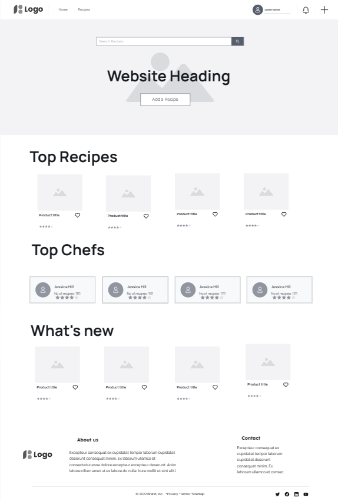

#### Recipes Page

Single recipe Page

    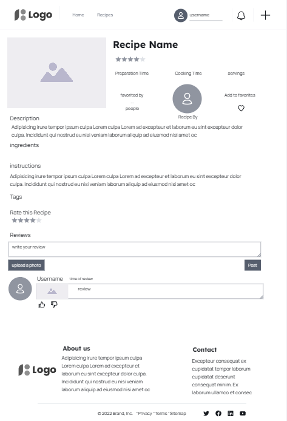

Recipe Grid page 

    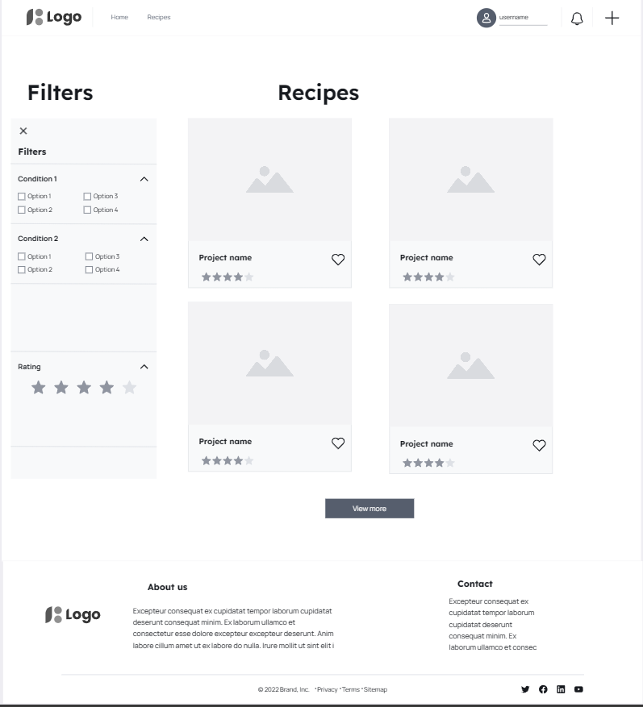

Recipe Create page

    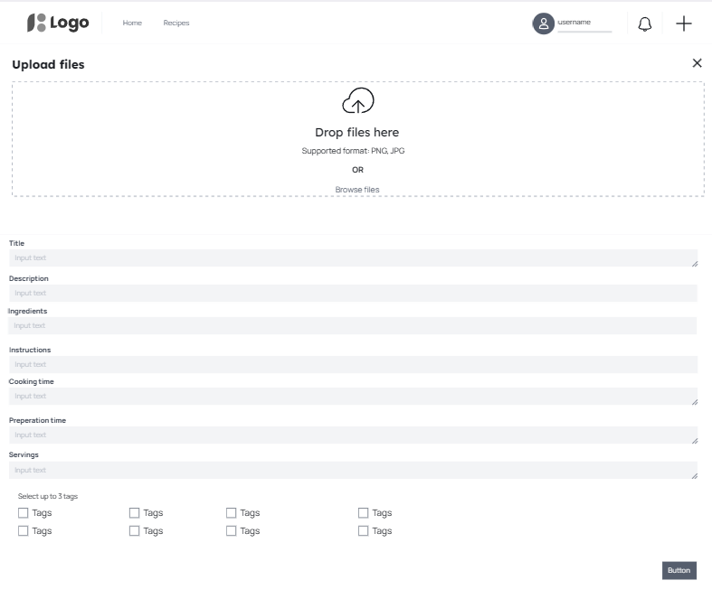

#### Signup/Login

    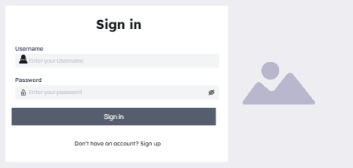

    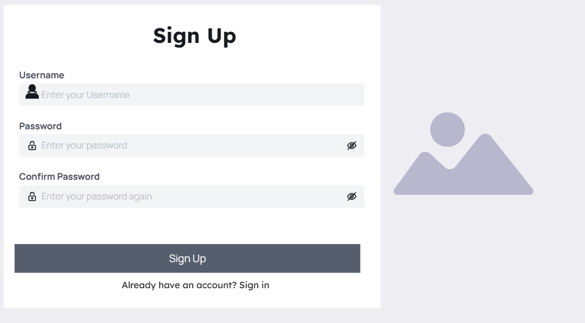

#### Edit Profile

    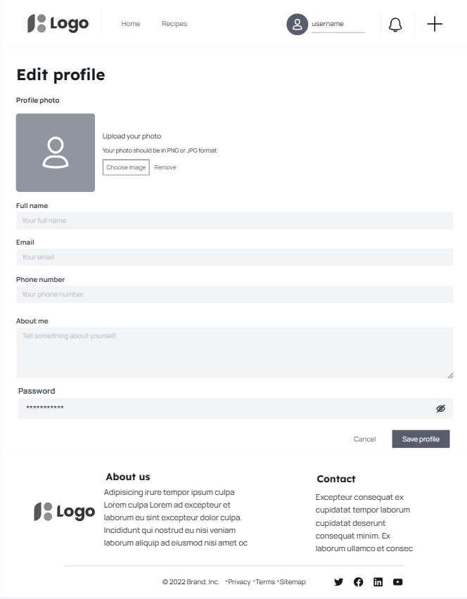

#### Profile Page

    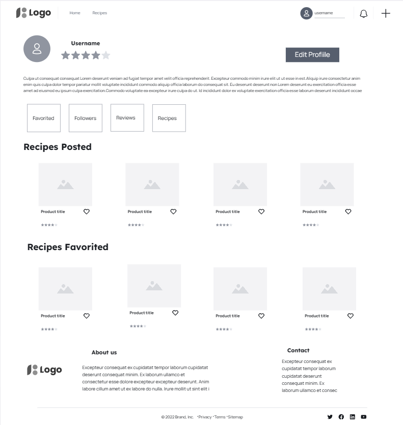

### Data models

Data models were planned alongside the wireframes. These are documented in the read-me for the backend [README-BACKEND.md](https://github.com/redifo/recipe-drf-api/blob/main/README-BACKEND.md).

## Design
### Colours
The primary goal for the color scheme of this project was to create a harmonious and visually appealing interface that promotes user engagement and comfort. The colors chosen reflect a blend of warmth and professionalism, suitable for a broad range of users.

Primary Color (#e4bf8d): This soft, earthy hue is used throughout the site for key UI elements such as navbar, footer, and profilecards. Its warm tone offers a welcoming and friendly vibe that enhances the user experience.
Secondary Color (#CF8D12): Employed consistently with the primary color, this shade adds a balanced, cohesive look across the site. It's used in less prominent but still significant UI components to maintain visual consistency.
Accent Color (#dd9d72): This slightly darker shade complements the primary and secondary colors by providing a subtle contrast. It's used for specific highlights and to draw attention to particular features, enhancing the site's overall aesthetic.
Follow Button Color (#242a3d): This deep, dark blue offers a striking contrast against the lighter shades of the primary and secondary colors. Used primarily for the 'follow' button, it stands out to encourage user interaction.
Active Focus Color (#C65C14): A bold, vibrant orange, this color is used to indicate active or focused states on certain buttons and icons. Its bright nature ensures that these elements catch the user's eye, guiding their navigation through the site.
Main background-color White (#FFFFFF): Provides a clean look and highlights other colors due to the contrast difference.

    

### Typography
For the typography, the choice of fonts and their application was aimed at complementing the color scheme and enhancing the site's readability and accessibility.

Font Family ("Merriweather Sans", sans-serif): This font was selected for its modern and friendly appearance, which aligns well with the overall aesthetic of the site. It provides excellent readability across various devices and screen sizes.
Font Optical Sizing (auto): Ensuring that the text is displayed optimally at different scales, this setting adjusts the font's weight and spacing based on the user's device or display settings.

## Features

### User-Friendly Home Page
Recipe Domain offers a simple, intuitive interface that allows users to navigate the platform with ease. Users can create accounts, create recipes, and browse a most favorited and latest recipes along with most followed chefs.

    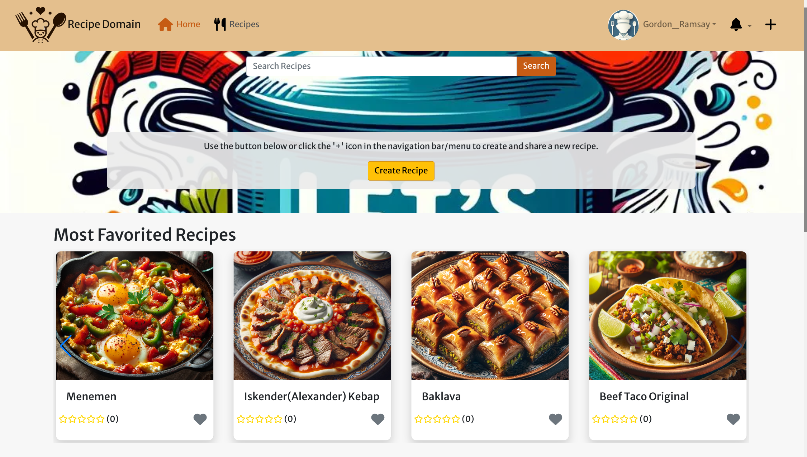

### Recipe Creation and Management
Users can easily add new recipes by filling out a form with fields for the recipe title, description, ingredients, and instructions, accompanied by an image upload feature. Each recipe can be edited or updated at any time, providing flexibility for users to improve or correct their submissions.

    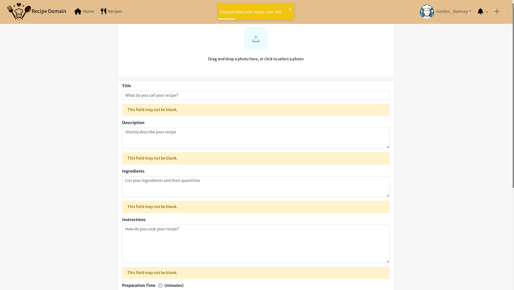

### Recipe Search and Filtering
The platform includes a robust search functionality that allows users to search for recipes based on title, ingredients, or tags. This makes it easy for users to find exactly what they're looking for, whether they want a quick dinner idea or something specific like a vegetarian dish.Users can filter recipes based on their tags.

    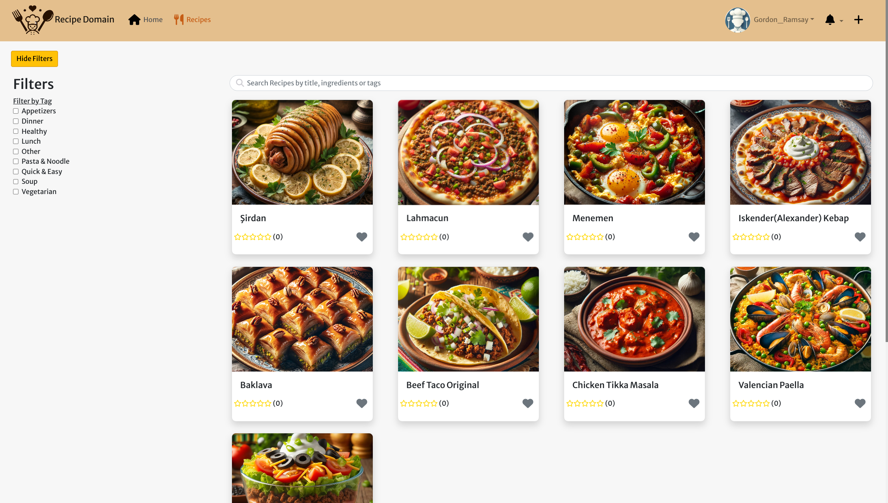

### Dynamic Recipe Rating and Reviews
Each recipe can be rated on a five-star scale and reviewed by users. This community feedback system helps users to choose recipes based on community endorsements and personal tastes.

    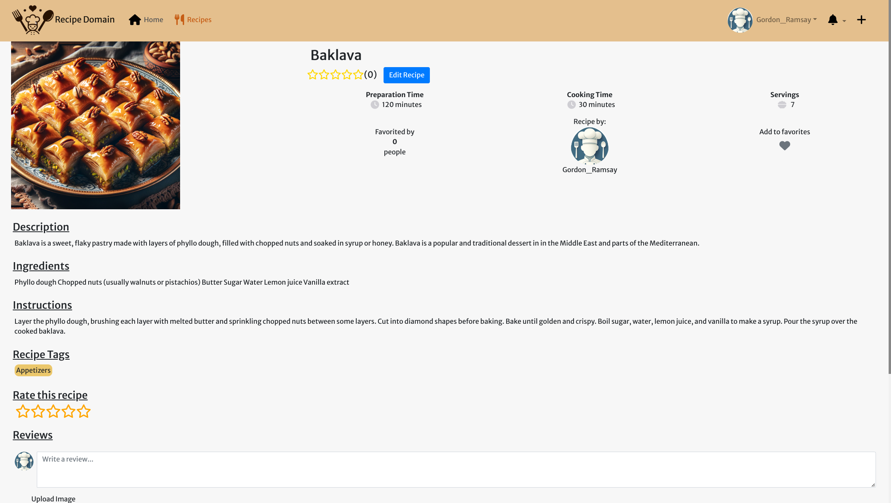

### Social Interaction and Engagement
Users can follow other chefs and food enthusiasts, allowing them to stay updated on new recipes posted by their favorite creators. The "Most Followed Chefs" section highlights popular contributors, fostering a community of engaged food lovers.

    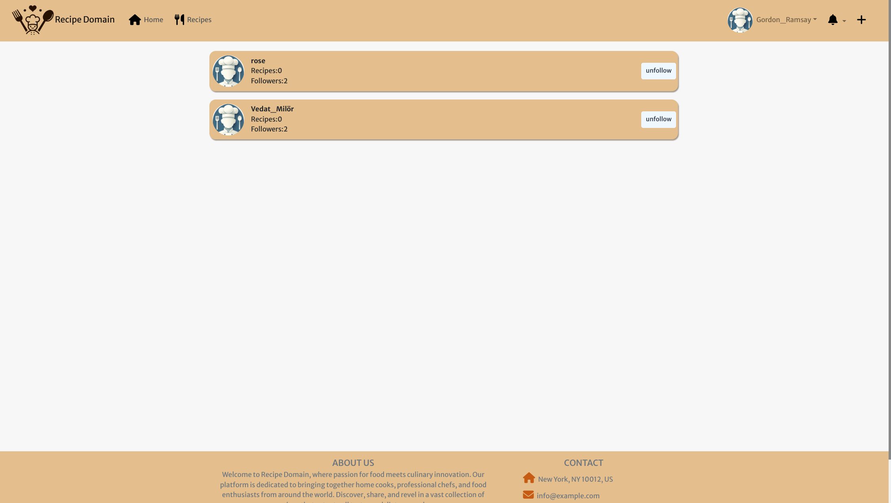

### Mobile Responsive Design
Recipe Domain is fully responsive, ensuring that users have a seamless experience on both desktop and mobile devices. This accessibility enhances user engagement and allows users to interact with the platform anywhere, at any time.

### Security Features
Sign-up and sign-in forms incorporate error handling to guide users for a secure account creation process. Password strength requirements and feedback ensure that user accounts are protected against unauthorized access.

    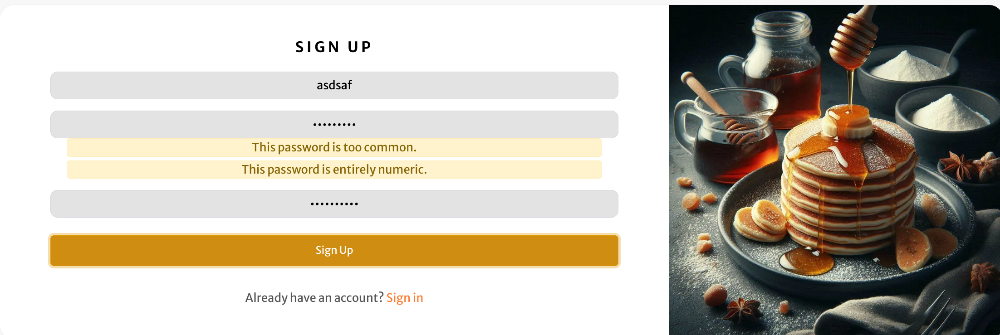

For defensive measures all form fileds are defensive both on the backend and frontend. On the front end users cannot tpye more than that is accepted by the backend (both for numbers and text fields) and on the backend the fileds are limited by the use of valuevalidators. 

### Recipe Tag Filtering
Recipe Domain includes a user-friendly drop-down menu that enables users to filter recipes based on specific tags such as Appetizers, Dinner, Healthy, Lunch, Pasta & Noodle, Quick & Easy, Soup, and Vegetarian. This feature allows users to quickly find recipes that match their dietary preferences or meal planning needs.

### Personalized User Profiles with Enhanced Customization
Users can create personalized profiles that not only display their recipes and favorite dishes but also allow them to add a profile bio text. This personal bio gives others insight into the user’s culinary interests or expertise. Profile customization options include the ability to change the username and password, providing users with full control over their account settings and enhancing security.

    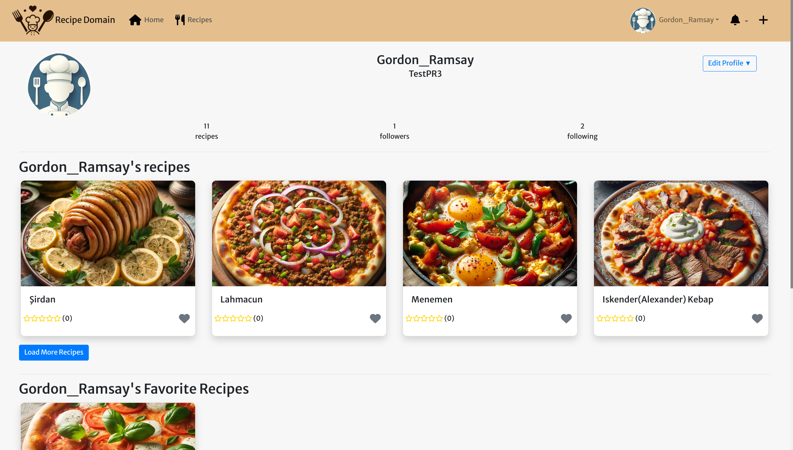

### Favorite Recipes Feature
Recipe Domain incorporates a "Favorite Recipes" feature, which enables users to mark recipes they love and want to easily access again. Each user’s profile page displays a section dedicated to their favorited recipes, allowing for quick retrieval and viewing.

    

## Re-use of Components

A number of reusable React components were created with the intention of reducing code duplication and ensuring a consistent look and feel across the application.

### **Asset.js**
- **Purpose**: Used to display a spinner, image, or message based on the props it receives. This component is utilized across the application to handle loading states, display images, or show messages when data is being fetched or no content is available.
- **Props**:
  - `spinner`: Boolean to decide if a loading spinner should be shown.
  - `src`: String URL for the image to display.
  - `message`: String message to display below the image or spinner.
- **Usage**: This component is embedded in various parts of the application like error pages (NotFound.js) and during loading states across different views.

### **Avatar.js**
- **Purpose**: Displays user avatars in various sizes throughout the application, enhancing user recognition and personalization.
- **Props**:
  - `src`: Source URL of the avatar image.
  - `height`: Height of the avatar image, with a default of 45 pixels.
  - `text`: Optional text to display alongside the avatar.
- **Usage**: Utilized in user-related components such as profile views, comments, and wherever user identity is important.

### **MoreDropdown.js**
- **Purpose**: Provides a customizable dropdown menu for editing and deleting actions, complete with a confirmation modal for deletions.
- **Props**:
  - `handleEdit`: Function to trigger when the edit action is selected.
  - `handleDelete`: Function to trigger when the delete action is confirmed.
- **Usage**: Commonly used in components that require user interaction for modifying or deleting content, such as profiles and recipe details.

### **Notifications.js**
- **Purpose**: Manages and displays notifications to the user, allowing actions like marking notifications as read or deleting them.
- **Props**: Uses internal state and context to fetch and manage notifications based on the current user.
- **Usage**: Embedded in user-centric areas like the NavBar to show real-time updates about user interactions, recipe updates, and more.

### **NavBar.js**
- **Purpose**: Serves as the primary navigation bar for the application, dynamically adjusting its content based on the user's login status.
- **Props**: Utilizes the `useCurrentUser` context to determine which set of navigation options to display.
- **Usage**: Placed at the top of every page, providing consistent navigation and access to user profiles, recipe creation, and authentication options.

### **NotFound.js**
- **Purpose**: Displays a user-friendly message and image when a requested page or content is not found.
- **Props**: Utilizes the Asset component to present a consistent not-found message.
- **Usage**: Used in routing to handle unknown URLs or inaccessible content, ensuring a better user experience in error scenarios.

### **FooterPage.js**
- **Purpose**: Provides a consistent footer across all pages with about, contact information, and social links.
- **Props**: None specific, but maintains a consistent look and feel with links and information about the platform.
- **Usage**: Appears at the bottom of every page, offering additional information and navigation options related to the platform and its creator.

### **ProfileDataContext**
- **Purpose**: Manages profile data throughout the application, providing centralized access and manipulation functions for profile information.
- **Usage**: Embedded in components that require real-time updates to profile data, such as follow/unfollow actions, and updating popular or followed profiles.
- **Props**: Provides `handleFollow` and `handleUnfollow` methods to manage follow states and updates the relevant parts of the profile data accordingly.

### **CurrentUserContext**
- **Purpose**: Provides and manages the current user's data across the application, ensuring that user-specific features and restrictions are applied consistently.
- **Usage**: Used throughout the application to determine user access levels, personalize content, and handle authentication states.
- **Props**: Offers `currentUser` for accessing the current user's information and `setCurrentUser` for updating this information as needed.

### **SignInForm**
- **Purpose**: Allows users to sign in to their accounts, handling credential verification and user session initiation.
- **Usage**: Used on the sign-in page to authenticate users and provide them access to their personalized content.
- **Props**: Accepts user input for username and password and displays relevant errors or redirects upon successful login.

### **SignUpForm**
- **Purpose**: Facilitates new user registration by collecting necessary information and creating a new user account.
- **Usage**: Placed on the sign-up page to allow new users to create accounts and join the community.
- **Props**: Collects user inputs for username, password, and password confirmation and handles account creation with appropriate error handling.

### **PopularProfiles**
- **Purpose**: Displays a list or a swiper slider of popular profiles based on follower count, enhancing user discovery of prominent community members.
- **Usage**: Utilized in community sections or dashboards where showcasing popular profiles can encourage user interaction and engagement.
- **Props**: Can be rendered in a card layout or as a standard list, depending on the `card` prop, to suit different design needs.

### **Profile**
- **Purpose**: Represents individual profiles in various sections of the application, offering follow/unfollow functionality and displaying key profile metrics.
- **Usage**: Used in lists or galleries where individual profile summaries are needed, such as in search results or community highlights.
- **Props**: Accepts `profile`, `mobile`, `imageSize`, and `card` to customize the display according to the context and user device.

### **RecipeCard**
- **Purpose**: Showcases individual recipes with key details such as title, image, and ratings, and allows users to favorite or unfavorite the recipe.
- **Usage**: Embedded in search results, user profiles, and recipe collections to provide a consistent recipe preview experience.
- **Props**: Manages favorite states with `isFavorited` and `favoriteId`, and allows interaction through a heart button for adding or removing recipes from favorites.

### **RecipePage**
- **Purpose**: Provides a detailed view of a single recipe, including description, ingredients, instructions, and user interactions like rating and reviewing.
- **Usage**: Displayed when a user selects a recipe to view more details, offering a comprehensive overview and interactive features.
- **Props**: Dynamically fetches and displays recipe data, tags, and reviews, and allows users to rate, favorite, and review the recipe if logged in.

### **ToastManager**
- **Purpose**: Provides feedback to users by displaying success, error, and warning messages using the `react-toastify` library.
- **Usage**: Integrated across the application to show user-friendly messages after actions like liking a review, following/unfollowing profiles, managing recipe favorites, and more.
- **Methods**:
  - `showSuccess(message)`: Displays a success message.
  - `showError(message)`: Displays an error message.
  - `showWarning(message)`: Displays a warning message.

### **Utilities**
- **fetchMoreData(resourceUrl, setResource)**: Fetches additional data from a specified URL and appends it to the current state, facilitating pagination or infinite scrolling.
- **followHelper(profile, clickedProfile, following_id)**: Adjusts the follow count and state based on user actions to follow another profile.
- **unfollowHelper(profile, clickedProfile)**: Adjusts the follow count and state when a user unfollows another profile.
- **setTokenTimestamp(data)**: Stores the refresh token expiration time in local storage to manage user session longevity.
- **shouldRefreshToken()**: Checks if the refresh token needs to be updated based on stored timestamps.
- **removeTokenTimestamp()**: Clears the stored token timestamp from local storage to manage logout and session expiration.

### **Review**
- **Purpose**: Displays individual reviews with options to like, dislike, edit, or delete the review based on user permissions and review ownership.
- **Usage**: Used in recipe detail pages to show user reviews and provide interactive elements like liking/disliking and editing.
- **Props**:
  - `review`: The review object containing details like user, text, likes, and dislikes.
  - `setReviews`: Function to update the list of reviews after actions like deletion or editing.

### **RateRecipe**
- **Purpose**: Allows users to rate a recipe by selecting a score from 1 to 5 stars, with the ability to remove a rating if one exists.
- **Usage**: Appears on recipe detail pages to let users rate recipes and manage existing ratings.
- **Props**:
  - `recipeId`: The ID of the recipe being rated.
  - `currentUser`: The current user object to determine if the user is logged in and permitted to rate.
  - `initialRating`: The initial rating of the recipe by the current user to display the current score.

Each component and context provider is designed to reduce redundancy, streamline development, and ensure that the user interface remains consistent and responsive throughout the application.

## Future Enhancements
-### Short-Term Improvements

#### Notifications
- **Issue Resolution**: Address the current limitation where marking notifications as read has no visible effect on the front end. Implement a clear visual indicator or a different section for read vs. unread notifications to enhance user experience.
- **Expand Notification Triggers**: Broaden the scope of events that trigger notifications. Include notifications for when users like a recipe, follow a user, or comment on recipes, not just for reviews on owned recipes.

#### Recipe Filters
- **Enhanced Filtering Options**: Improve the recipe tag filtering feature by adding more specific categories and dietary preferences like vegan, gluten-free, or low-carb options.
- **Dynamic Filter Updates**: Ensure that the recipe list updates dynamically when filters are applied, without needing a page refresh, to provide a smoother user experience.

#### User Interface
- **Responsive Design Tweaks**: Conduct a thorough review of the mobile and tablet views to fix any inconsistencies or usability issues that hinder the mobile-first experience.
- **Improved Form Feedback**: Enhance error handling in sign-in and sign-up forms to provide more specific and helpful feedback for common issues like incorrect credentials or weak passwords.
- **Collect More User Data**: Update registration and profile settings forms to collect additional information, such as culinary preferences and dietary restrictions, to personalize the user experience further.

### Long-Term Improvements

#### Advanced Personalization
- **Recipe Recommendations**: Develop a machine learning or algorithm-based system to recommend recipes based on user preferences, previous interactions, and popular trends.
- **Customizable User Dashboards**: Allow users to customize their dashboards to highlight their favorite types of recipes, followed chefs, and any upcoming food-related events or news.

#### Social Features
- **Recipe Sharing and Collaboration**: Enable users to collaborate on recipes, share modifications, and create joint collections or cookbooks with friends or community members.

#### Security and Privacy
- **Two-Factor Authentication (2FA)**: Implement 2FA to enhance account security, especially for users who manage or share sensitive dietary information.

#### Performance and Scalability
- **Optimize Backend Processes**: Review and optimize database queries and server responses to handle increasing traffic and data as the user base grows.
- **Microservices Architecture**: Consider adopting a microservices architecture for better load handling and improved application scalability.

These improvements aim to address immediate concerns and set the foundation for sustained growth and user satisfaction. By continuously refining features and infrastructure, Recipe Domain can enhance its market position and user loyalty.

## Technologies Used

### Frontend
- **React**: Utilized for building the user interface with interactive components. [React](https://reactjs.org/)
- **Bootstrap**: Employed for responsive design, ensuring the website adapts to various device sizes. [Bootstrap](https://getbootstrap.com/)
- **React Bootstrap**: Extended Bootstrap functionalities within React applications for consistent styling and component behavior. [React Bootstrap](https://react-bootstrap.github.io/)
- **React Router DOM**: Enabled dynamic client-side routing to improve user navigation and single-page application flow. [React Router DOM](https://reactrouter.com/)
- **React Dropzone**: Used for drag-and-drop file upload functionality, enhancing the user experience in uploading images. [React Dropzone](https://react-dropzone.js.org/)
- **React Toastify**: Provided user-friendly notifications and feedback for actions like errors, successes, and warnings. [React Toastify](https://fkhadra.github.io/react-toastify/)
- **Swiper**: Integrated for creating responsive, touch-friendly carousels to showcase recipes and other content attractively. [Swiper](https://swiperjs.com/)
- **MDBReact**: A Material Design UI kit for Bootstrap that adds material design styles and components (only used for footer due to version compatibility issues and other useful components requiring paid subscription). [MDBReact](https://mdbootstrap.com/docs/react/)

### Backend
A more detailed list of technologies used (with versions used for the project) for the backend can be found in [Backend README.md](https://github.com/redifo/recipe-drf-api/blob/main/README-BACKEND.md).

- **Django Rest Framework**: Served as the foundation for creating RESTful APIs to handle client-server interactions efficiently. [Django Rest Framework](https://www.django-rest-framework.org/)
- **JWT Authentication**: Ensured secure and scalable user authentication using JSON Web Tokens. [JWT.io](https://jwt.io/)
- **Cloudinary**: Used for cloud-based image storage, simplifying the management of user-uploaded images. [Cloudinary](https://cloudinary.com/)
- **Django Filters**: Implemented for advanced querying capabilities, allowing users to filter recipes and other content based on various criteria. [Django Filters](https://django-filter.readthedocs.io/en/stable/)
- **WhiteNoise**: Facilitated efficient static file serving in Django applications, especially when deployed. [WhiteNoise](http://whitenoise.evans.io/)
- **Django Rest Auth & Allauth**: Provided comprehensive user authentication, including registration and login functionalities. [Django Rest Auth](https://dj-rest-auth.readthedocs.io/en/latest/), [Allauth](https://django-allauth.readthedocs.io/en/latest/)
- **CORS Headers**: Configured to allow resource sharing between the frontend and backend, supporting cross-origin requests. [Django CORS Headers](https://github.com/adamchainz/django-cors-headers)

### Database
- **Neon Database**: Utilized [Neon](https://neon.tech/) for the database to leverage its cloud-native PostgreSQL capabilities, ensuring scalable and efficient data management.
- **PostgreSQL**: Chosen for its robustness and scalability in storing and managing user and recipe data. [PostgreSQL](https://www.postgresql.org/)

### Utilities & Additional Tools
- **Heroku**: Used for deploying the application, offering a platform-as-a-service environment that integrates with Git for continuous deployment. [Heroku](https://www.heroku.com/)
- **ESLint**: Assured code quality and consistency by detecting and correcting syntax and style issues in JavaScript code. [ESLint](https://eslint.org/)

### Libraries & Packages
- **axios**: Facilitated making HTTP requests to the backend, simplifying data retrieval and submission. [Axios](https://axios-http.com/)
- **jwt-decode**: Decoded JWTs client-side to extract user information and manage authentication state. [JWT Decode](https://www.npmjs.com/package/jwt-decode)

### Other Programs Used

* [amiresponsive.blogspot.com](https://amiresponsive.blogspot.com/) - to create the responsive mockup view

* [Bing.com Dall-e](https://www.bing.com/images/create/?ref=hn) - Used to create all the images within the website.

* [Canva.com](https://www.canva.com/) To edit some of the images generated by dalle-3.
  
* [convertio.co](https://convertio.co) To covert images into webp format.

* [coolors.co](https://coolors.co/) - Used to create color palette photo.

* [Favicon.io](https://favicon.io/) To create favicon from the logo created by Dall-e 3.

* [Git](https://git-scm.com/) - For version control.

* [Github](https://github.com/) - To save and store the files for the website.

* [Google Fonts](https://fonts.google.com/) - To import the fonts used on the website.

* [Google Developer Tools](https://developers.google.com/web/tools) - To troubleshoot and test features, solve issues with responsiveness and styling.

* [visily](https://app.visily.ai/) - Used to create wireframes.

* [Webpage Spell-Check](https://chrome.google.com/webstore/detail/webpage-spell-check/mgdhaoimpabdhmacaclbbjddhngchjik/related) - a google chrome extension that allows you to spell check your webpage. Used to check the site and the readme for spelling errors.

## Testing

Please refer to the links below for backend and frontend testing documentation.
[FRONTEND-TESTING](https://github.com/redifo/recipe-drf-api/blob/main/FRONTEND-TESTING.md).
[BACKEND-TESTING](https://github.com/redifo/recipe-drf-api/blob/main/BACKEND-TESTING.md).

## Deployment

To deploy this project, which consists of both a backend and a frontend within the same GitHub directory, follow these steps to ensure a smooth setup and deployment on Heroku. This guide assumes you're familiar with basic GitHub operations and have a Heroku account.

### Step 1: Fork or Clone the Repository
1. **Fork or clone** the repository from GitHub to get your own copy or version.
   - If you are forking, use the GitHub interface to create a fork under your account.
   - If cloning, use `git clone` followed by the repository URL.

### Step 2: Set Up Cloudinary
2. **Set up a Cloudinary account** for hosting user profile images.
   - Log in to [Cloudinary](https://cloudinary.com/).
   - Navigate to the 'dashboard'.
   - Copy the value of the 'API Environment variable' (starts with `cloudinary://`). Click the eye icon to reveal the full variable if necessary. Keep this value safe as it will be used shortly (but ensure it is securely destroyed after deployment).

### Step 3: Deploy to Heroku
3. **Log in to Heroku** and set up your application.
   - Select 'Create new app' from the 'New' menu at the top right of the Heroku dashboard.
   - Enter a name for your app and choose the appropriate region.
   - Click 'Create app'.

### Step 4: Configure Environment Variables in Heroku
4. **Configure environment variables** in Heroku to connect your app with necessary services.
   - In the Heroku dashboard for your app, go to the 'Settings' tab.
   - Click 'Reveal Config Vars'.
   - Add the following keys and their respective values:
     - `CLOUDINARY_URL`: Paste the Cloudinary URL you copied earlier.
     - `DATABASE_URL`: Set this to your PostgreSQL database URL. If using a service like ElephantSQL, copy the URL from their dashboard.
     - `SECRET_KEY`: Your Django application's secret key.
     - `ALLOWED_HOST`: The URL of your Heroku app, but without the `https://` prefix.
     - `CLIENT_ORIGIN`: The URL where your frontend will be accessed, typically the same as `ALLOWED_HOST` but includes `https://`.

### Step 5: Deploy Backend and Frontend
5. **Deploy the backend and frontend** from your GitHub repository.
   - Go to the 'Deploy' tab in the Heroku dashboard.
   - Under 'Deployment method', select 'GitHub' and confirm you want to connect to GitHub. You may need to authenticate.
   - Use the search box under 'Connect to GitHub' to find your forked or cloned repository.
   - Click 'Connect' next to the correct repository.
   - For automatic deployment upon new pushes to GitHub, under 'Automatic Deploys', choose the main branch and click 'Enable Automatic Deploys'.
   - To deploy immediately, find the 'Manual Deploy' section, choose 'main' as the branch, and click 'Deploy Branch'.

After completing these steps, Heroku will build and deploy your application. Once the process is finished, you'll receive a link to the deployed site. This link gives you and others access to the fully functional application hosted online.

## Credits
- **Code**: 

- **Media**: All photos (backgrounds, profile and recipe defaults, all recipe pictures etc) were generated by Dalle-3.

- **Acknowledgements**: I want to thank my girlfriend for always supporting and giving feedback on this project. Her role as a real-life customer has been incredibly helpful.
I want to thank my brother Dogukan Redif for helping with testing.
I want to thank Jubril Akole, for guiding me and sharing his expertise.
