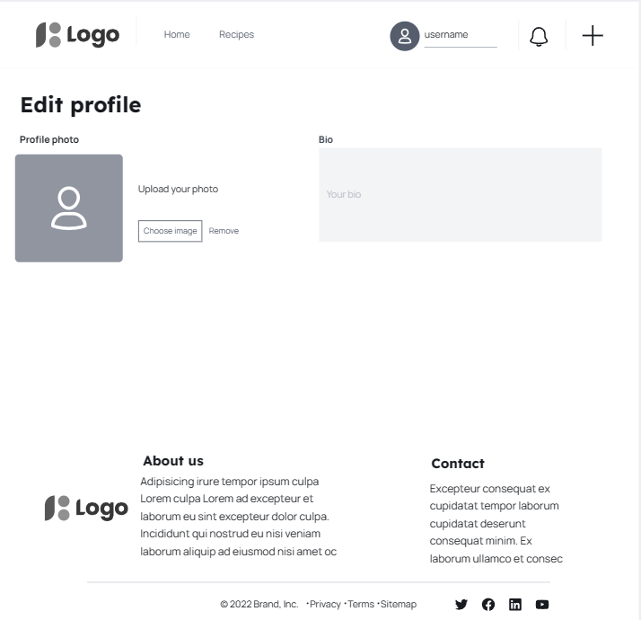

# Recipe Domain

    

Recipe Domain is an interactive web application designed to simplify the process of finding, organizing, and sharing culinary recipes. It serves as a central hub for food enthusiasts to discover new recipes, manage their favorites, and share their culinary creations with others. The platform aims to provide a user-friendly environment where users can easily search, filter, and interact with a wide variety of recipes.

***Links to other readme and testing files.***
[Backend README.md](https://github.com/redifo/recipe-drf-api/blob/main/README-BACKEND.md).
[FRONTEND-TESTING](https://github.com/redifo/recipe-drf-api/blob/main/FRONTEND-TESTING.md).
[BACKEND-TESTING](https://github.com/redifo/recipe-drf-api/blob/main/BACKEND-TESTING.md).

## Project Goals
The main goals of Recipe Domain are:
1) Provide a platform for users to easily find recipes based on various criteria such as ingredients or cooking time.
2) Allow users to save and organize their favorite recipes in a personalized way.
3) Enable users to share recipes with others and participate in a community of food enthusiasts.
4) Offer a intuitive user interface that is accessible to users of all tech skill levels.

## Table of Contents
- [Recipe Domain](#recipe-domain)
  * [Project Goals](#project-goals)
  * [Table of Contents](#table-of-contents)
  * [User Stories and Agile Development Methodology](#user-stories-and-agile-development-methodology)
  * [Planning](#planning)
  * [Design](#design)
  * [Features](#features)
  * [Technologies Used](#technologies-used)
  * [Testing](#testing)
  * [Deployment](#deployment)
  * [Credits](#credits)

## User Stories and Agile Development Methodology

In this project, I used an agile development methodology to manage the development process efficiently. I document each feature and task as an issue within GitHub, utilizing the MoSCoW prioritization method. Labels such as 'Must Have', 'Should Have', 'Could Have', and 'Won't Have' help in determining the essential features necessary for a Minimum Viable Product (MVP) and guide the prioritization of enhancements.

I've categorized each issue further as either a 'User Story' or 'Development Task' and assigned a size label from 1 to 5, indicating the complexity and expected effort. This setup provides a clear roadmap and assists in workload management throughout the development phases.

Each issue that has label user story is a user story, which is a description of a feature or functionality that a user would want to have in the application.
Issues can be found at: [GitHub Project Issues](https://github.com/redifo/recipe-domain/issues) 

To systematically track the progress, I've organized the development lifecycle into 8 sprints, represented as milestones on GitHub. These sprints do not have specific due dates but are crucial in grouping and scheduling tasks and user stories, allowing for structured and phased development.

Ideally each sprint should begin with setting up a GitHub project board for that cycle, where tasks are moved from the product backlog into the current iteration based on their assigned priority and relevance to the ongoing sprint goals. However due to frequent user story (issues) changes and cross dependencies between issues and sprints, the sprints were only used as a general guide and the whole project was managed in a signle github project board.

The progress of the project is visually managed using a kanban board within the GitHub project. Tasks are dynamically moved between 'Todo', 'In Progress', and 'Done' columns, reflecting real-time progress and facilitating adjustments as needed.

For a detailed view of the development process, please visit my [GitHub Project Boards](https://github.com/users/redifo/projects/4).

This structured approach not only keeps the project organized but also aligns with agile principles, ensuring flexibility and responsiveness to change throughout the development cycle.

## Planning

### Wireframes

Wireframes were produced based on those user stories that had been identified.

#### Home

    

#### Recipes Page

Single recipe Page

    

Recipe Grid page 

    

Recipe Create page

    

#### Signup/Login

    

    

#### Edit Profile

    

#### Profile Page

    

### Data models

Data models were planned alongside the wireframes. These are documented in the read-me for the backend [README-BACKEND.md](https://github.com/redifo/recipe-drf-api/blob/main/README-BACKEND.md).

## Design
### Colours
The primary goal for the color scheme of this project was to create a harmonious and visually appealing interface that promotes user engagement and comfort. The colors chosen reflect a blend of warmth and professionalism, suitable for a broad range of users.

Primary Color (#e4bf8d): This soft, earthy hue is used throughout the site for key UI elements such as navbar, footer, and profilecards. Its warm tone offers a welcoming and friendly vibe that enhances the user experience.
Secondary Color (#CF8D12): Employed consistently with the primary color, this shade adds a balanced, cohesive look across the site. It's used in less prominent but still significant UI components to maintain visual consistency.
Accent Color (#dd9d72): This slightly darker shade complements the primary and secondary colors by providing a subtle contrast. It's used for specific highlights and to draw attention to particular features, enhancing the site's overall aesthetic.
Follow Button Color (#242a3d): This deep, dark blue offers a striking contrast against the lighter shades of the primary and secondary colors. Used primarily for the 'follow' button, it stands out to encourage user interaction.
Active Focus Color (#C65C14): A bold, vibrant orange, this color is used to indicate active or focused states on certain buttons and icons. Its bright nature ensures that these elements catch the user's eye, guiding their navigation through the site.
Main background-color White (#FFFFFF): Provides a clean look and highlights other colors due to the contrast difference.

    

### Typography
For the typography, the choice of fonts and their application was aimed at complementing the color scheme and enhancing the site's readability and accessibility.

Font Family ("Merriweather Sans", sans-serif): This font was selected for its modern and friendly appearance, which aligns well with the overall aesthetic of the site. It provides excellent readability across various devices and screen sizes.
Font Optical Sizing (auto): Ensuring that the text is displayed optimally at different scales, this setting adjusts the font's weight and spacing based on the user's device or display settings.

## Features
### Essential Features
- **Recipe Search**: Users can search for recipes based on keywords, ingredients, or tags.
- **Filter Recipes**: Users can filter recipes based on criteria such as cook time, and tags.
- **Recipe Management**: Users can create, edit, and delete their own recipes.
- **User Profiles**: Users can create profiles to manage their recipes and preferences.
- **Social Interaction**: Users can share recipes and interact with other users.

### Future Enhancements
- Integration with grocery shopping lists.
- Meal planning tools.
- Advanced dietary filtering.
- Recipe recommendations based on user preferences and past activities.

## Technologies Used

### Frontend
- **React**: Utilized for building the user interface with interactive components. [React](https://reactjs.org/)
- **Bootstrap**: Employed for responsive design, ensuring the website adapts to various device sizes. [Bootstrap](https://getbootstrap.com/)
- **React Bootstrap**: Extended Bootstrap functionalities within React applications for consistent styling and component behavior. [React Bootstrap](https://react-bootstrap.github.io/)
- **React Router DOM**: Enabled dynamic client-side routing to improve user navigation and single-page application flow. [React Router DOM](https://reactrouter.com/)
- **React Dropzone**: Used for drag-and-drop file upload functionality, enhancing the user experience in uploading images. [React Dropzone](https://react-dropzone.js.org/)
- **React Toastify**: Provided user-friendly notifications and feedback for actions like errors, successes, and warnings. [React Toastify](https://fkhadra.github.io/react-toastify/)
- **Swiper**: Integrated for creating responsive, touch-friendly carousels to showcase recipes and other content attractively. [Swiper](https://swiperjs.com/)
- **MDBReact**: A Material Design UI kit for Bootstrap that adds material design styles and components (only used for footer due to version compatibility issues and other useful components requiring paid subscription). [MDBReact](https://mdbootstrap.com/docs/react/)

### Backend
A more detailed list of technologies used (with versions used for the project) for the backend can be found in [Backend README.md](https://github.com/redifo/recipe-drf-api/blob/main/README-BACKEND.md).

- **Django Rest Framework**: Served as the foundation for creating RESTful APIs to handle client-server interactions efficiently. [Django Rest Framework](https://www.django-rest-framework.org/)
- **JWT Authentication**: Ensured secure and scalable user authentication using JSON Web Tokens. [JWT.io](https://jwt.io/)
- **Cloudinary**: Used for cloud-based image storage, simplifying the management of user-uploaded images. [Cloudinary](https://cloudinary.com/)
- **Django Filters**: Implemented for advanced querying capabilities, allowing users to filter recipes and other content based on various criteria. [Django Filters](https://django-filter.readthedocs.io/en/stable/)
- **WhiteNoise**: Facilitated efficient static file serving in Django applications, especially when deployed. [WhiteNoise](http://whitenoise.evans.io/)
- **Django Rest Auth & Allauth**: Provided comprehensive user authentication, including registration and login functionalities. [Django Rest Auth](https://dj-rest-auth.readthedocs.io/en/latest/), [Allauth](https://django-allauth.readthedocs.io/en/latest/)
- **CORS Headers**: Configured to allow resource sharing between the frontend and backend, supporting cross-origin requests. [Django CORS Headers](https://github.com/adamchainz/django-cors-headers)

### Database
- **Neon Database**: Utilized [Neon](https://neon.tech/) for the database to leverage its cloud-native PostgreSQL capabilities, ensuring scalable and efficient data management.
- **PostgreSQL**: Chosen for its robustness and scalability in storing and managing user and recipe data. [PostgreSQL](https://www.postgresql.org/)

### Utilities & Additional Tools
- **Heroku**: Used for deploying the application, offering a platform-as-a-service environment that integrates with Git for continuous deployment. [Heroku](https://www.heroku.com/)
- **ESLint**: Assured code quality and consistency by detecting and correcting syntax and style issues in JavaScript code. [ESLint](https://eslint.org/)

### Libraries & Packages
- **axios**: Facilitated making HTTP requests to the backend, simplifying data retrieval and submission. [Axios](https://axios-http.com/)
- **jwt-decode**: Decoded JWTs client-side to extract user information and manage authentication state. [JWT Decode](https://www.npmjs.com/package/jwt-decode)

### Other Programs Used

* [amiresponsive.blogspot.com](https://amiresponsive.blogspot.com/) - to create the responsive mockup view

* [Bing.com Dall-e](https://www.bing.com/images/create/?ref=hn) - Used to create all the images within the website.

* [Canva.com](https://www.canva.com/) To edit some of the images generated by dalle-3.
  
* [convertio.co](https://convertio.co) To covert images into webp format.

* [coolors.co](https://coolors.co/) - Used to create color palette photo.

* [Favicon.io](https://favicon.io/) To create favicon from the logo created by Dall-e 3.

* [Git](https://git-scm.com/) - For version control.

* [Github](https://github.com/) - To save and store the files for the website.

* [Google Fonts](https://fonts.google.com/) - To import the fonts used on the website.

* [Google Developer Tools](https://developers.google.com/web/tools) - To troubleshoot and test features, solve issues with responsiveness and styling.

* [visily](https://app.visily.ai/) - Used to create wireframes.

* [Webpage Spell-Check](https://chrome.google.com/webstore/detail/webpage-spell-check/mgdhaoimpabdhmacaclbbjddhngchjik/related) - a google chrome extension that allows you to spell check your webpage. Used to check the site and the readme for spelling errors.

## Testing

Please refer to the links below for backend and frontend testing documentation.
[FRONTEND-TESTING](https://github.com/redifo/recipe-drf-api/blob/main/FRONTEND-TESTING.md).
[BACKEND-TESTING](https://github.com/redifo/recipe-drf-api/blob/main/BACKEND-TESTING.md).

## Deployment

To deploy this project, which consists of both a backend and a frontend within the same GitHub directory, follow these steps to ensure a smooth setup and deployment on Heroku. This guide assumes you're familiar with basic GitHub operations and have a Heroku account.

### Step 1: Fork or Clone the Repository
1. **Fork or clone** the repository from GitHub to get your own copy or version.
   - If you are forking, use the GitHub interface to create a fork under your account.
   - If cloning, use `git clone` followed by the repository URL.

### Step 2: Set Up Cloudinary
2. **Set up a Cloudinary account** for hosting user profile images.
   - Log in to [Cloudinary](https://cloudinary.com/).
   - Navigate to the 'dashboard'.
   - Copy the value of the 'API Environment variable' (starts with `cloudinary://`). Click the eye icon to reveal the full variable if necessary. Keep this value safe as it will be used shortly (but ensure it is securely destroyed after deployment).

### Step 3: Deploy to Heroku
3. **Log in to Heroku** and set up your application.
   - Select 'Create new app' from the 'New' menu at the top right of the Heroku dashboard.
   - Enter a name for your app and choose the appropriate region.
   - Click 'Create app'.

### Step 4: Configure Environment Variables in Heroku
4. **Configure environment variables** in Heroku to connect your app with necessary services.
   - In the Heroku dashboard for your app, go to the 'Settings' tab.
   - Click 'Reveal Config Vars'.
   - Add the following keys and their respective values:
     - `CLOUDINARY_URL`: Paste the Cloudinary URL you copied earlier.
     - `DATABASE_URL`: Set this to your PostgreSQL database URL. If using a service like ElephantSQL, copy the URL from their dashboard.
     - `SECRET_KEY`: Your Django application's secret key.
     - `ALLOWED_HOST`: The URL of your Heroku app, but without the `https://` prefix.
     - `CLIENT_ORIGIN`: The URL where your frontend will be accessed, typically the same as `ALLOWED_HOST` but includes `https://`.

### Step 5: Deploy Backend and Frontend
5. **Deploy the backend and frontend** from your GitHub repository.
   - Go to the 'Deploy' tab in the Heroku dashboard.
   - Under 'Deployment method', select 'GitHub' and confirm you want to connect to GitHub. You may need to authenticate.
   - Use the search box under 'Connect to GitHub' to find your forked or cloned repository.
   - Click 'Connect' next to the correct repository.
   - For automatic deployment upon new pushes to GitHub, under 'Automatic Deploys', choose the main branch and click 'Enable Automatic Deploys'.
   - To deploy immediately, find the 'Manual Deploy' section, choose 'main' as the branch, and click 'Deploy Branch'.

After completing these steps, Heroku will build and deploy your application. Once the process is finished, you'll receive a link to the deployed site. This link gives you and others access to the fully functional application hosted online.

## Credits
- **Code**: 

- **Media**: All photos (backgrounds, profile and recipe defaults, all recipe pictures etc) were generated by Dalle-3.

- **Acknowledgements**: I want to thank my girlfriend for always supporting and giving feedback on this project. Her role as a real-life customer has been incredibly helpful.
I want to thank my brother Dogukan Redif for helping with testing.
I want to thank Jubril Akole, for guiding me and sharing his expertise.
